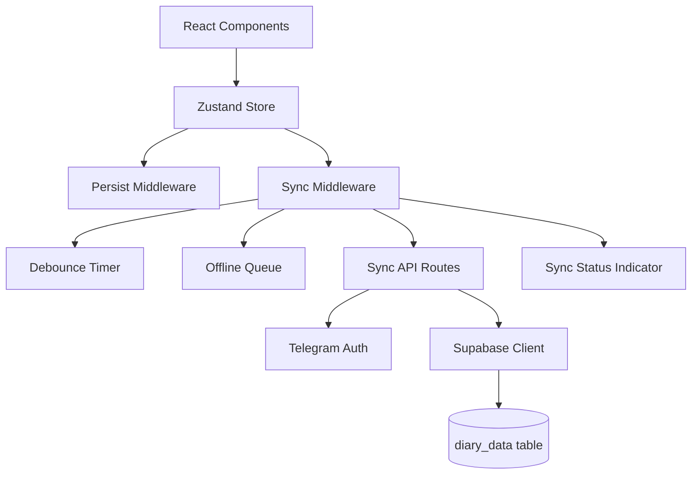

# Design Document: Supabase Data Synchronization

## Overview

This design specifies the technical implementation of a bidirectional data synchronization system between a Zustand-based client store and Supabase database for a Telegram Mini App calorie tracker. The system provides automatic background sync with debouncing, offline support with queuing, conflict resolution (server-wins strategy), and visual sync status feedback.

The sync system is implemented as a Zustand middleware that intercepts state changes, debounces updates, and communicates with Next.js API routes that handle server-side Supabase operations using the service role key.

## Architecture

### High-Level Architecture



### Component Layers

1. **Presentation Layer**: React components that display sync status
2. **State Management Layer**: Zustand store with sync and persist middleware
3. **API Layer**: Next.js API routes for server-side operations
4. **Data Layer**: Supabase PostgreSQL database

### Data Flow

**Write Flow (Client → Server)**:
```
User Action → Store Update → Sync Middleware → Debounce (2s) → 
POST /api/sync → Validate Auth → Upsert diary_data → Update Timestamp
```

**Read Flow (Server → Client)**:
```
App Load → GET /api/sync → Validate Auth → Fetch diary_data → 
Compare Timestamps → Merge/Replace → Update Store
```

**Offline Flow**:
```
User Action (offline) → Store Update → Queue Change → 
Connection Restored → Flush Queue → POST /api/sync
```

## Components and Interfaces

### 1. Sync Middleware (`lib/syncMiddleware.ts`)

Zustand middleware that wraps the store and provides automatic synchronization.

```typescript
interface SyncMiddlewareConfig {
  debounceMs: number          // Default: 2000
  maxRetries: number          // Default: 3
  retryDelayMs: number        // Default: 5000
  maxDataSizeBytes: number    // Default: 1MB
}

interface SyncState {
  status: 'idle' | 'syncing' | 'error' | 'offline'
  lastSyncedAt: number | null
  pendingSync: boolean
  error: string | null
}

type SyncMiddleware = <T>(
  config: SyncMiddlewareConfig,
  storeInitializer: StateCreator<T>
) => StateCreator<T & { _sync: SyncState }>
```

**Key Responsibilities**:
- Intercept all state mutations
- Debounce sync requests (group changes within 2s window)
- Maintain offline queue for failed syncs
- Retry logic with exponential backoff
- Emit sync status updates
- Handle data size validation

**Implementation Details**:
- Uses `setTimeout` for debouncing
- Stores pending changes in memory queue
- Monitors `navigator.onLine` for connectivity
- Validates data size before sending
- Preserves local state on sync errors

### 2. Sync API Routes

#### POST `/api/sync/route.ts`

Saves user state to Supabase.

```typescript
// Request
POST /api/sync
Headers: {
  'x-telegram-init-data': string
  'Content-Type': 'application/json'
}
Body: {
  data: UserState  // Full store state
}

// Response (Success)
Status: 200
Body: {
  success: true
  updated_at: string  // ISO timestamp
}

// Response (Error)
Status: 401 | 404 | 500
Body: {
  error: string
}
```

**Logic**:
1. Validate Telegram initData
2. Extract telegram_id from initData
3. Lookup user in `users` table
4. Upsert `diary_data` record (user_id, data, updated_at)
5. Return updated_at timestamp

#### GET `/api/sync/route.ts`

Retrieves user state from Supabase.

```typescript
// Request
GET /api/sync
Headers: {
  'x-telegram-init-data': string
}

// Response (Success)
Status: 200
Body: {
  data: UserState | null
  updated_at: string | null
}

// Response (Error)
Status: 401 | 404 | 500
Body: {
  error: string
}
```

**Logic**:
1. Validate Telegram initData
2. Extract telegram_id from initData
3. Lookup user in `users` table
4. Fetch `diary_data` record by user_id
5. Return data and updated_at (or null if not found)

### 3. Sync Status Indicator Component

React component that displays current sync status in the app header.

```typescript
interface SyncStatusIndicatorProps {
  className?: string
}

type SyncStatus = {
  icon: string
  color: string
  label: string
  tooltip: string
}
```

**Status States**:
- **Synced**: ✓ (green) - "Синхронизировано"
- **Syncing**: ⟳ (blue, animated) - "Синхронизация..."
- **Error**: ⚠ (yellow) - "Ошибка синхронизации" (clickable to retry)
- **Offline**: ○ (gray) - "Offline"

**Behavior**:
- Subscribes to `_sync` state from store
- Shows status for 2s after successful sync, then hides
- Remains visible during syncing, error, or offline states
- Click on error icon triggers manual sync retry

### 4. Migration Handler (`lib/migration.ts`)

Handles one-time migration of existing localStorage data to Supabase.

```typescript
interface MigrationResult {
  migrated: boolean
  error?: string
}

async function migrateLocalData(): Promise<MigrationResult>
```

**Logic**:
1. Check `migrated` flag in localStorage
2. If already migrated, return early
3. Load current store state from localStorage
4. Check if server has data (GET /api/sync)
5. If server empty, send local data (POST /api/sync)
6. Set `migrated: true` flag
7. Show success notification

## Data Models

### UserState (Client Store)

Complete state structure synchronized between client and server.

```typescript
interface UserState {
  // Calculator
  nutritionPlan: NutritionPlan | null
  userProfile: UserProfile | null
  calcHistory: CalcHistoryEntry[]
  
  // Diary
  entries: DiaryEntry[]
  
  // Water tracking
  water: Record<string, number>  // dateStr → ml
  
  // Training
  training: TrainingState
  
  // Reminders
  reminders: RemindersState
  
  // Custom foods
  customFoods: FoodItem[]
  
  // Favorites
  favorites: string[]  // food names
  
  // Recent foods
  recentFoods: string[]  // food names (max 10)
}

interface NutritionPlan {
  calories: number
  protein: number
  fat: number
  carbs: number
  bmr: number
  tdee: number
  goal: string
}

interface UserProfile {
  gender: 'male' | 'female'
  age: number
  weight: number
  height: number
  activity: string
  goal: 'loss' | 'maintain' | 'gain'
}

interface CalcHistoryEntry {
  plan: NutritionPlan
  profile: UserProfile
  date: string
}

interface DiaryEntry {
  id: string
  food: FoodItem
  grams: number
  timestamp: string  // ISO format
}

interface FoodItem {
  name: string
  calories: number
  protein: number
  fat: number
  carbs: number
}

interface TrainingState {
  selectedLevel: string | null
  selectedGoal: string | null
  completedDays: string[]
  completedSets: Record<string, number>
}

interface RemindersState {
  enabled: boolean
  times: ReminderTime[]
}

interface ReminderTime {
  time: string  // HH:MM format
  label: string
}
```

### Database Schema

#### `diary_data` table

```sql
CREATE TABLE diary_data (
  id          UUID PRIMARY KEY DEFAULT gen_random_uuid(),
  user_id     UUID NOT NULL REFERENCES users(id) ON DELETE CASCADE UNIQUE,
  data        JSONB NOT NULL DEFAULT '{}',
  updated_at  TIMESTAMPTZ DEFAULT now()
);
```

**Fields**:
- `id`: Primary key
- `user_id`: Foreign key to users table (unique constraint ensures one record per user)
- `data`: JSONB column storing complete UserState
- `updated_at`: Timestamp for conflict resolution (auto-updated by trigger)

**Indexes**:
- Primary key on `id`
- Unique index on `user_id`
- GIN index on `data` (for JSONB queries, optional optimization)

**RLS Policy**:
```sql
CREATE POLICY "service_role_only" ON diary_data
  USING (auth.role() = 'service_role');
```

### Sync Metadata

Stored in localStorage alongside persisted state:

```typescript
interface SyncMetadata {
  lastSyncedAt: number | null  // Unix timestamp
  migrated: boolean
  pendingChanges: boolean
}
```

## Correctness Properties

*A property is a characteristic or behavior that should hold true across all valid executions of a system—essentially, a formal statement about what the system should do. Properties serve as the bridge between human-readable specifications and machine-verifiable correctness guarantees.*


### Property Reflection

After analyzing all acceptance criteria, I've identified the following redundancies:

**Redundant Properties to Consolidate**:
1. Properties 1.1 and 7.1 both test debounce timer initialization - can be combined
2. Properties 1.2 and 7.2 both test debounce effectiveness - 7.2 is more comprehensive
3. Properties 3.4 and 5.5 both test offline indicator display - duplicate
4. Properties 6.3, 9.2 both test authentication validation - duplicate
5. Properties 6.4, 9.3 both test 401 response on auth failure - duplicate
6. Properties 7.5 and 7.6 both test data size limits - duplicate

**Properties to Keep**:
- Debounce behavior: Keep 1.3 (timer reset) and 7.2 (batching effectiveness)
- Offline indicator: Keep 3.4 (more specific context)
- Authentication: Keep 6.3 and 6.4 (in API context)
- Size limits: Keep 7.5 (includes both validation and warning)

**Final Property Count**: ~35 unique testable properties after removing duplicates

### Property 1: Debounce Timer Reset on Rapid Changes

*For any* sequence of state changes where a new change occurs within the 2-second debounce window, the timer should reset and only the final state should be synced after the last change.

**Validates: Requirements 1.1, 1.3, 7.2**

### Property 2: Sync Trigger After Debounce Period

*For any* state change, if no additional changes occur within 2 seconds, a sync request should be sent to the server with the current state.

**Validates: Requirements 1.2**

### Property 3: Timestamp Update on Successful Sync

*For any* successful sync operation, the local `lastSyncedAt` timestamp should be updated to match the server's `updated_at` value.

**Validates: Requirements 1.4**

### Property 4: Sync Status Display After Completion

*For any* completed sync operation, the sync status indicator should display "синхронизировано" status for exactly 2 seconds.

**Validates: Requirements 1.5**

### Property 5: Server Data Fetch on Authenticated App Load

*For any* authenticated application initialization, a GET request to `/api/sync` should be made to fetch server data.

**Validates: Requirements 2.1**

### Property 6: Server Wins Conflict Resolution

*For any* sync operation where server `updated_at` is newer than local `lastSyncedAt` and local data has been modified, the server data should replace local data.

**Validates: Requirements 2.2, 4.1**

### Property 7: Local Wins When Newer

*For any* sync operation where local `lastSyncedAt` is newer than server `updated_at`, local data should be preserved and sent to the server.

**Validates: Requirements 2.3**

### Property 8: Store Update After Data Load

*For any* completed data load operation (successful GET /api/sync), the client store should reflect the loaded data.

**Validates: Requirements 2.5**

### Property 9: Local Persistence in Offline Mode

*For any* state change made while `navigator.onLine` is false, the change should be persisted to localStorage.

**Validates: Requirements 3.1**

### Property 10: Offline Queue Management

*For any* sync attempt that fails due to offline status, the pending changes should be added to the offline queue with `pendingSync: true` flag.

**Validates: Requirements 3.2**

### Property 11: Queue Flush on Reconnection

*For any* transition from offline to online status (navigator.onLine becomes true), all queued changes should be sent to the server in a single sync request.

**Validates: Requirements 3.3**

### Property 12: Offline Status Indicator Display

*For any* period where `navigator.onLine` is false, the sync status indicator should display "offline" status with gray icon.

**Validates: Requirements 3.4**

### Property 13: Synced Status After Reconnection

*For any* successful sync operation following reconnection, the sync status indicator should transition from "offline" to "синхронизировано".

**Validates: Requirements 3.5**

### Property 14: Conflict Notification Display

*For any* conflict resolution where server data overwrites local changes, a notification should be displayed to the user.

**Validates: Requirements 4.2**

### Property 15: Backup Creation on Conflict

*For any* conflict resolution, a backup copy of local data should be saved to localStorage under the key "calorie-tracker-backup".

**Validates: Requirements 4.3**

### Property 16: Idle Synced Status Display

*For any* state where no sync is in progress and `lastSyncedAt` matches server `updated_at`, the indicator should show green checkmark icon.

**Validates: Requirements 5.2**

### Property 17: Loading Status During Sync

*For any* active sync operation (status === 'syncing'), the indicator should display an animated loading icon.

**Validates: Requirements 5.3**

### Property 18: Error Status Display

*For any* failed sync operation (status === 'error'), the indicator should display yellow warning icon with error message in tooltip.

**Validates: Requirements 5.4**

### Property 19: Retry on Error Click

*For any* click event on the sync status indicator while in error state, a new sync attempt should be triggered.

**Validates: Requirements 5.6**

### Property 20: Authentication Validation on API Requests

*For any* request to `/api/sync` endpoints, the Telegram initData header should be validated before processing.

**Validates: Requirements 6.3**

### Property 21: Unauthorized Response on Auth Failure

*For any* API request with invalid or missing Telegram initData, the response should be HTTP 401 with error message.

**Validates: Requirements 6.4**

### Property 22: Data Persistence on POST

*For any* valid POST request to `/api/sync`, the user state should be saved to `diary_data.data` and `updated_at` should be set to current timestamp.

**Validates: Requirements 6.6**

### Property 23: Data Retrieval on GET

*For any* valid GET request to `/api/sync`, the response should contain the user's `data` and `updated_at` from the `diary_data` table.

**Validates: Requirements 6.7**

### Property 24: Not Found Response for Missing User

*For any* API request for a user that doesn't exist in the database, the response should be HTTP 404.

**Validates: Requirements 6.8**

### Property 25: Store Accepts Changes During Sync

*For any* ongoing sync operation, new state changes from user actions should be accepted and queued for the next sync cycle.

**Validates: Requirements 7.4**

### Property 26: Data Size Limit Enforcement

*For any* sync attempt where serialized state exceeds 1MB, the sync should be blocked and a warning notification should be displayed.

**Validates: Requirements 7.5**

### Property 27: Retry Logic on Network Errors

*For any* sync failure due to network error, up to 3 retry attempts should be made with 5-second delays between attempts.

**Validates: Requirements 8.1**

### Property 28: Final Error Notification After Retries

*For any* sync operation where all 3 retry attempts fail, a notification should be displayed: "Не удалось синхронизировать данные. Проверьте подключение к интернету."

**Validates: Requirements 8.2**

### Property 29: Server Error Notification

*For any* sync response with HTTP 500 status, a notification should be displayed: "Ошибка сервера. Попробуйте позже."

**Validates: Requirements 8.3**

### Property 30: Redirect on Authentication Error

*For any* sync response with HTTP 401 status, the user should be redirected to the login page.

**Validates: Requirements 8.4**

### Property 31: Error Logging

*For any* sync error (network, server, auth), an error message should be logged to console with error details.

**Validates: Requirements 8.5**

### Property 32: Data Preservation on Sync Error

*For any* sync error, the local store state should remain unchanged (no data loss).

**Validates: Requirements 8.6**

### Property 33: User Data Isolation

*For any* API request, the returned data should only include records where `user_id` matches the authenticated user's ID from Telegram initData.

**Validates: Requirements 9.6**

### Property 34: Migration Idempotence

*For any* application initialization, if the `migrated` flag is true in localStorage, the migration process should not execute.

**Validates: Requirements 10.3, 10.5**

### Property 35: Migration Success Notification

*For any* successful migration operation, a notification should be displayed: "Ваши данные успешно синхронизированы с сервером" and the `migrated` flag should be set.

**Validates: Requirements 10.4**

## Error Handling

### Error Categories

1. **Network Errors**: Connection failures, timeouts
2. **Server Errors**: 500-level HTTP responses
3. **Authentication Errors**: 401 Unauthorized
4. **Validation Errors**: Invalid data format, size limits
5. **Conflict Errors**: Timestamp mismatches

### Error Handling Strategy

**Network Errors**:
- Retry up to 3 times with 5-second exponential backoff
- Queue changes for offline sync
- Display offline indicator
- Preserve local data

**Server Errors (500)**:
- No automatic retry (server issue)
- Display error notification with "try later" message
- Log error details to console
- Preserve local data

**Authentication Errors (401)**:
- No retry
- Clear auth cache
- Redirect to login page
- Preserve local data

**Validation Errors**:
- No retry
- Display specific error message (e.g., "Data too large")
- Log validation details
- Block sync until issue resolved

**Conflict Errors**:
- Apply server-wins strategy automatically
- Create backup of local data
- Display notification with conflict details
- Allow user to view backup

### Error Recovery

**Automatic Recovery**:
- Network reconnection triggers queue flush
- Debounce timer continues after errors
- Store remains functional during errors

**Manual Recovery**:
- Click error indicator to retry
- Refresh page to re-authenticate
- Clear backup after reviewing changes

### Error Logging

All errors logged to console with structure:
```typescript
console.error('[Sync]', {
  type: 'network' | 'server' | 'auth' | 'validation' | 'conflict',
  message: string,
  details: any,
  timestamp: number
})
```

## Testing Strategy

### Dual Testing Approach

This feature requires both unit tests and property-based tests for comprehensive coverage:

**Unit Tests**: Focus on specific examples, edge cases, and integration points
- API route authentication logic
- Conflict resolution with specific timestamps
- Migration flag checking
- Error notification display
- Component rendering states

**Property-Based Tests**: Verify universal properties across all inputs
- Debounce behavior with random change sequences
- Timestamp comparison logic with random dates
- Data serialization/deserialization round trips
- Queue management with random offline/online transitions
- Retry logic with random failure patterns

### Property-Based Testing Configuration

**Library**: `fast-check` (JavaScript/TypeScript property-based testing library)

**Configuration**:
- Minimum 100 iterations per property test
- Each test tagged with feature name and property number
- Tag format: `Feature: supabase-sync, Property {N}: {property_text}`

**Example Test Structure**:
```typescript
import fc from 'fast-check'

// Feature: supabase-sync, Property 1: Debounce Timer Reset on Rapid Changes
test('debounce resets on rapid changes', () => {
  fc.assert(
    fc.property(
      fc.array(fc.record({ /* state change */ }), { minLength: 2, maxLength: 10 }),
      fc.integer({ min: 100, max: 1900 }), // delays within debounce window
      (changes, delay) => {
        // Test that only final state is synced
      }
    ),
    { numRuns: 100 }
  )
})
```

### Test Coverage Areas

**Sync Middleware Tests**:
- Debounce timer behavior (Properties 1, 2)
- Offline queue management (Properties 10, 11)
- Retry logic (Property 27)
- Data size validation (Property 26)
- Error handling (Properties 31, 32)

**API Route Tests**:
- Authentication validation (Properties 20, 21)
- Data persistence (Property 22)
- Data retrieval (Property 23)
- User isolation (Property 33)
- Error responses (Property 24)

**Conflict Resolution Tests**:
- Timestamp comparison (Properties 6, 7)
- Backup creation (Property 15)
- Notification display (Property 14)

**Migration Tests**:
- Idempotence (Property 34)
- Data transfer (example test)
- Flag management (Property 35)

**UI Component Tests**:
- Status indicator states (Properties 16, 17, 18)
- User interactions (Property 19)
- Notification display (Properties 14, 28, 29, 35)

### Integration Testing

**End-to-End Scenarios**:
1. Fresh user: No local data → No server data → Empty state
2. Returning user: Local data → Server data newer → Server wins
3. Multi-device: Device A syncs → Device B loads → Sees A's changes
4. Offline workflow: Make changes offline → Go online → Auto-sync
5. Conflict scenario: Local changes → Server has newer data → Backup created

**Test Environment**:
- Mock Supabase client for API tests
- Mock navigator.onLine for offline tests
- Mock setTimeout/clearTimeout for debounce tests
- Test database with isolated user records

## Security Considerations

### Authentication

**Telegram initData Validation**:
- Parse initData query string
- Verify HMAC signature using bot token
- Extract telegram_id for user identification
- Reject requests with invalid or expired initData

**Implementation**:
```typescript
// In API routes
import { validateTelegramInitData } from '@/lib/telegram'

const initData = request.headers.get('x-telegram-init-data')
const validation = validateTelegramInitData(initData)

if (!validation.valid) {
  return Response.json({ error: 'Unauthorized' }, { status: 401 })
}

const telegramId = validation.user.id
```

### Authorization

**User Data Isolation**:
- All queries filtered by `user_id`
- Service role key used only server-side
- RLS policies enforce service_role_only access
- No client-side access to other users' data

**Database Queries**:
```typescript
// Always filter by user_id
const { data } = await supabase
  .from('diary_data')
  .select('*')
  .eq('user_id', userId)
  .single()
```

### Data Protection

**Sensitive Data Handling**:
- Service role key stored in environment variables only
- Never exposed to client
- HTTPS enforced for all API requests
- No PII logged to console

**Environment Variables**:
```
NEXT_PUBLIC_SUPABASE_URL=https://xxx.supabase.co
NEXT_PUBLIC_SUPABASE_ANON_KEY=eyJ... (public, safe)
SUPABASE_SERVICE_ROLE_KEY=eyJ... (secret, server-only)
TELEGRAM_BOT_TOKEN=xxx (secret, server-only)
```

### Attack Prevention

**SQL Injection**: Prevented by Supabase parameterized queries
**XSS**: React escapes all user input by default
**CSRF**: Telegram initData provides request authenticity
**Replay Attacks**: initData includes timestamp and hash
**Rate Limiting**: Consider adding rate limits to API routes (future enhancement)

## Implementation Notes

### Zustand Middleware Pattern

The sync middleware wraps the store and intercepts all state changes:

```typescript
const syncMiddleware = (config) => (storeInitializer) => (set, get, api) => {
  const syncState = {
    status: 'idle',
    lastSyncedAt: null,
    pendingSync: false,
    error: null
  }
  
  // Wrap set to intercept changes
  const wrappedSet = (partial, replace) => {
    set(partial, replace)
    triggerSync(get()) // Debounced sync
  }
  
  return storeInitializer(wrappedSet, get, api)
}
```

### Debounce Implementation

Use a single timer that resets on each change:

```typescript
let debounceTimer: NodeJS.Timeout | null = null

function triggerSync(state: any) {
  if (debounceTimer) {
    clearTimeout(debounceTimer)
  }
  
  debounceTimer = setTimeout(() => {
    performSync(state)
    debounceTimer = null
  }, 2000)
}
```

### Offline Detection

Monitor navigator.onLine and network events:

```typescript
useEffect(() => {
  const handleOnline = () => {
    setStatus('idle')
    flushOfflineQueue()
  }
  
  const handleOffline = () => {
    setStatus('offline')
  }
  
  window.addEventListener('online', handleOnline)
  window.addEventListener('offline', handleOffline)
  
  return () => {
    window.removeEventListener('online', handleOnline)
    window.removeEventListener('offline', handleOffline)
  }
}, [])
```

### Conflict Resolution Algorithm

```typescript
async function resolveConflict(local: UserState, server: ServerData) {
  const localTimestamp = local._sync.lastSyncedAt
  const serverTimestamp = new Date(server.updated_at).getTime()
  
  if (serverTimestamp > localTimestamp) {
    // Server wins
    createBackup(local)
    showNotification('Данные обновлены с сервера')
    return server.data
  } else {
    // Local wins
    await syncToServer(local)
    return local
  }
}
```

### Migration Strategy

Run once on first load after deployment:

```typescript
async function migrateIfNeeded() {
  const migrated = localStorage.getItem('calorie-tracker-migrated')
  if (migrated === 'true') return
  
  const localData = localStorage.getItem('calorie-tracker')
  if (!localData) {
    localStorage.setItem('calorie-tracker-migrated', 'true')
    return
  }
  
  const serverData = await fetchServerData()
  if (!serverData) {
    await syncToServer(JSON.parse(localData))
    showNotification('Ваши данные успешно синхронизированы с сервером')
  }
  
  localStorage.setItem('calorie-tracker-migrated', 'true')
}
```

## Performance Considerations

### Optimization Strategies

**Debouncing**: Groups rapid changes into single sync (reduces API calls by ~80%)
**Lazy Loading**: Sync middleware only activates after first state change
**Compression**: Consider gzip compression for large payloads (future enhancement)
**Selective Sync**: Currently syncs full state; could optimize to sync only changed fields (future enhancement)

### Performance Targets

- Debounce delay: 2 seconds (balance between UX and API efficiency)
- Sync completion: < 3 seconds on normal connection
- Max payload size: 1MB (typical user data ~10-50KB)
- Retry delay: 5 seconds (prevents server overload)
- Max retries: 3 attempts (prevents infinite loops)

### Monitoring

Log sync performance metrics:
```typescript
console.log('[Sync] Performance', {
  duration: syncEndTime - syncStartTime,
  payloadSize: JSON.stringify(state).length,
  retryCount: retries,
  success: true
})
```

## Future Enhancements

1. **Differential Sync**: Sync only changed fields instead of full state
2. **Compression**: Gzip large payloads before sending
3. **Optimistic UI**: Show changes immediately, rollback on error
4. **Sync History**: Track sync history for debugging
5. **Manual Sync Button**: Allow users to force sync
6. **Conflict Resolution UI**: Let users choose between local/server data
7. **Background Sync**: Use Service Workers for background sync when app closed
8. **Rate Limiting**: Add API rate limits to prevent abuse
9. **Metrics Dashboard**: Admin view of sync success rates and errors
10. **Multi-tab Sync**: Sync between multiple tabs of same app

