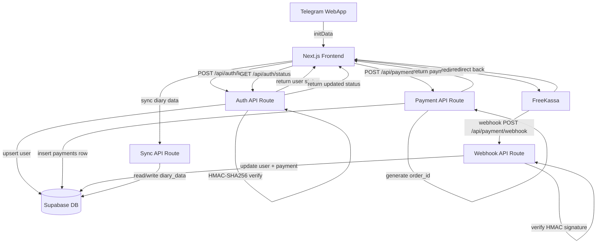

# Design Document: User Auth & Payment

## Overview

Добавление системы аккаунтов и монетизации в Telegram Mini App «Калорийный трекер».

Приложение уже работает как Next.js SPA на Vercel. Данные хранятся в localStorage через Zustand. В рамках этой фичи добавляются:

- **Авторизация** через Telegram WebApp initData (HMAC-SHA256 верификация на сервере)
- **Бесплатный пробный период** 3 дня с момента первой регистрации
- **Монетизация** — разовый платёж 50 рублей через FreeKassa, открывающий пожизненный доступ
- **Синхронизация данных** дневника и настроек через Supabase
- **Бэкенд** — Next.js API Routes (без отдельного сервера)

### Ключевые решения

| Решение | Обоснование |
|---|---|
| Авторизация через Telegram initData | Нет отдельного логина/пароля, пользователь уже в Telegram |
| Supabase (бесплатный tier) | Managed PostgreSQL + Row Level Security, не нужен отдельный сервер |
| FreeKassa webhook + redirect | Webhook — надёжная активация на сервере; redirect — хороший UX |
| Next.js API Routes | Бэкенд уже в том же репозитории, нет отдельного деплоя |
| Пожизненный доступ (не подписка) | Простая модель, один платёж, нет рекуррентных списаний |

---

## Architecture



### Компоненты системы

```
frontend/
  app/
    api/
      auth/
        login/route.ts       ← Auth_Service: верификация initData, upsert user
        status/route.ts      ← Auth_Service: получение текущего статуса
      payment/
        create/route.ts      ← Payment_Service: создание платёжной ссылки
        webhook/route.ts     ← Payment_Service: обработка FreeKassa webhook
      sync/
        route.ts             ← синхронизация данных дневника
    profile/
      page.tsx               ← страница профиля с кнопкой оплаты
  components/
    AccessGuard.tsx          ← HOC/wrapper: проверка доступа, экран оплаты
    TrialBanner.tsx          ← баннер с оставшимся временем пробного периода
    ConsentScreen.tsx        ← экран согласия с условиями (первый запуск)
  lib/
    auth.ts                  ← клиентский хук useAuth, хранение статуса
    supabase.ts              ← Supabase client (браузер + сервер)
```

---

## Components and Interfaces

### Auth API Route — `POST /api/auth/login`

**Запрос:**
```typescript
// Headers: { 'x-telegram-init-data': string }
// Body: { acceptedTerms?: boolean }
```

**Ответ:**
```typescript
type AuthResponse = {
  user: {
    telegram_id: number
    username: string | null
    trial_started_at: string | null
    terms_accepted_at: string | null
    subscription_activated_at: string | null
  }
  access: AccessStatus
}

type AccessStatus = 
  | { type: 'pending_consent' }           // первый запуск, нет согласия
  | { type: 'trial'; remaining_hours: number }  // пробный период активен
  | { type: 'expired' }                   // пробный период истёк, нет подписки
  | { type: 'subscribed' }                // активная подписка
```

### Auth Status Route — `GET /api/auth/status`

Возвращает тот же `AuthResponse`. Используется для проверки статуса после редиректа с FreeKassa.

### Payment Create Route — `POST /api/payment/create`

**Запрос:**
```typescript
// Headers: { 'x-telegram-init-data': string }
```

**Ответ:**
```typescript
type PaymentCreateResponse = {
  payment_url: string  // URL для редиректа на FreeKassa
  order_id: string
}
```

### Payment Webhook Route — `POST /api/payment/webhook`

Принимает POST от FreeKassa (application/x-www-form-urlencoded). Верифицирует подпись, обновляет статус пользователя.

**Параметры от FreeKassa:**
```
MERCHANT_ID, AMOUNT, intid, MERCHANT_ORDER_ID, P_EMAIL, P_PHONE, 
CUR_ID, SIGN, us_telegram_id
```

### AccessGuard Component

```typescript
// Оборачивает защищённый контент
// Показывает ConsentScreen / TrialBanner / PaymentScreen в зависимости от статуса
<AccessGuard>
  {children}
</AccessGuard>
```

### useAuth Hook

```typescript
type UseAuthReturn = {
  status: AccessStatus | null
  user: User | null
  isLoading: boolean
  login: () => Promise<void>          // вызывается при загрузке приложения
  acceptTerms: () => Promise<void>    // подтверждение согласия
  createPayment: () => Promise<string> // возвращает payment_url
  refreshStatus: () => Promise<void>  // обновление статуса (после редиректа)
}
```

---

## Data Models

### Supabase: таблица `users`

```sql
CREATE TABLE users (
  id                      UUID PRIMARY KEY DEFAULT gen_random_uuid(),
  telegram_id             BIGINT UNIQUE NOT NULL,
  username                TEXT,
  first_name              TEXT,
  trial_started_at        TIMESTAMPTZ,
  terms_accepted_at       TIMESTAMPTZ,
  subscription_activated_at TIMESTAMPTZ,
  created_at              TIMESTAMPTZ DEFAULT now(),
  updated_at              TIMESTAMPTZ DEFAULT now()
);

-- RLS: только сервер (service_role) может писать
ALTER TABLE users ENABLE ROW LEVEL SECURITY;
```

### Supabase: таблица `payments`

```sql
CREATE TABLE payments (
  id          UUID PRIMARY KEY DEFAULT gen_random_uuid(),
  order_id    TEXT UNIQUE NOT NULL,   -- уникальный ID заказа для FreeKassa
  user_id     UUID NOT NULL REFERENCES users(id),
  amount      NUMERIC(10,2) NOT NULL,
  status      TEXT NOT NULL DEFAULT 'pending', -- pending | completed | failed
  created_at  TIMESTAMPTZ DEFAULT now(),
  updated_at  TIMESTAMPTZ DEFAULT now()
);

ALTER TABLE payments ENABLE ROW LEVEL SECURITY;
```

### Supabase: таблица `diary_data`

```sql
CREATE TABLE diary_data (
  id          UUID PRIMARY KEY DEFAULT gen_random_uuid(),
  user_id     UUID NOT NULL REFERENCES users(id) UNIQUE,
  data        JSONB NOT NULL DEFAULT '{}',  -- весь стейт Zustand store
  updated_at  TIMESTAMPTZ DEFAULT now()
);

ALTER TABLE diary_data ENABLE ROW LEVEL SECURITY;
```

### Переменные окружения

```env
# Supabase
NEXT_PUBLIC_SUPABASE_URL=
NEXT_PUBLIC_SUPABASE_ANON_KEY=
SUPABASE_SERVICE_ROLE_KEY=      # только на сервере

# Telegram
TELEGRAM_BOT_TOKEN=             # для HMAC-SHA256 верификации initData

# FreeKassa
FREEKASSA_MERCHANT_ID=
FREEKASSA_SECRET_WORD_1=        # для формирования подписи платёжной ссылки
FREEKASSA_SECRET_WORD_2=        # для верификации webhook
```

### FreeKassa: формирование подписи

```
// Подпись для платёжной ссылки:
MD5(MERCHANT_ID:AMOUNT:SECRET_WORD_1:CURRENCY:ORDER_ID)

// Подпись для верификации webhook:
MD5(MERCHANT_ID:AMOUNT:SECRET_WORD_2:MERCHANT_ORDER_ID)
```

### Telegram initData верификация (HMAC-SHA256)

```typescript
// 1. Разобрать initData как URLSearchParams
// 2. Извлечь hash, удалить из параметров
// 3. Отсортировать оставшиеся параметры по ключу, собрать data_check_string
// 4. secret_key = HMAC-SHA256(bot_token, "WebAppData")
// 5. computed_hash = HMAC-SHA256(data_check_string, secret_key)
// 6. Сравнить computed_hash с hash из initData
```


---

## Correctness Properties

*A property is a characteristic or behavior that should hold true across all valid executions of a system — essentially, a formal statement about what the system should do. Properties serve as the bridge between human-readable specifications and machine-verifiable correctness guarantees.*

### Property 1: Верификация initData отклоняет невалидные данные

*For any* строки initData, не подписанной корректным HMAC-SHA256 с секретным ключом бота (пустая строка, неверный hash, изменённые параметры, истёкший auth_date), функция верификации должна возвращать `false`, а API Route — отвечать кодом 401.

**Validates: Requirements 1.4, 1.5**

---

### Property 2: Upsert пользователя идемпотентен

*For any* валидного telegram_id, повторные вызовы `POST /api/auth/login` должны возвращать одну и ту же запись пользователя без создания дубликатов — количество записей с данным telegram_id в таблице `users` всегда равно 1.

**Validates: Requirements 1.2, 1.3**

---

### Property 3: Вычисление статуса доступа по времени

*For any* пользователя с установленным `trial_started_at` и без `subscription_activated_at`:
- если с момента `trial_started_at` прошло менее 72 часов — статус должен быть `trial`
- если прошло 72 или более часов — статус должен быть `expired`

**Validates: Requirements 2.2, 2.3, 4.1**

---

### Property 4: Инвариант trial_started_at при создании пользователя

*For any* нового пользователя, созданного через `POST /api/auth/login` с `acceptedTerms: true`, поле `trial_started_at` должно быть установлено и находиться в диапазоне [now() - 5s, now() + 5s].

**Validates: Requirements 2.1, 3.3**

---

### Property 5: Согласие с условиями — идемпотентность состояния

*For any* пользователя с `terms_accepted_at = null`, статус доступа всегда должен быть `pending_consent` независимо от количества вызовов `login`. Состояние не меняется без явного вызова `acceptTerms`.

**Validates: Requirements 3.4, 3.5**

---

### Property 6: Subscribed статус при наличии subscription_activated_at

*For any* пользователя с установленным `subscription_activated_at` (не null), вычисленный статус доступа должен быть `subscribed` независимо от значения `trial_started_at` и текущего времени.

**Validates: Requirements 4.3, 5.4**

---

### Property 7: Уникальность order_id для каждого платёжного запроса

*For any* двух вызовов `POST /api/payment/create` (даже для одного и того же пользователя), сгенерированные `order_id` должны быть различными, а в таблице `payments` не должно быть двух записей с одинаковым `order_id`.

**Validates: Requirements 5.1, 5.6**

---

### Property 8: Webhook верификация — корректность обработки подписи

*For any* входящего webhook от FreeKassa:
- если подпись `SIGN` валидна (MD5(MERCHANT_ID:AMOUNT:SECRET_WORD_2:ORDER_ID) совпадает) — пользователь получает `subscription_activated_at` и статус `subscribed`
- если подпись невалидна — статус пользователя и запись в `payments` не изменяются

**Validates: Requirements 5.3, 5.5**

---

### Property 9: Синхронизация данных — round-trip

*For any* набора данных дневника (записи о питании, настройки), сохранённых в Supabase через `POST /api/sync`, последующий `GET /api/sync` для того же `telegram_id` должен вернуть эквивалентные данные.

**Validates: Requirements 6.2, 6.3**

---

## Error Handling

### Auth API Routes

| Ситуация | HTTP код | Действие |
|---|---|---|
| Отсутствует заголовок `x-telegram-init-data` | 401 | Вернуть `{ error: 'Missing initData' }` |
| Невалидная подпись initData | 401 | Вернуть `{ error: 'Invalid initData' }` |
| Ошибка Supabase при upsert | 500 | Логировать, вернуть `{ error: 'Internal error' }` |

### Payment API Routes

| Ситуация | HTTP код | Действие |
|---|---|---|
| Пользователь не найден | 404 | Вернуть `{ error: 'User not found' }` |
| Невалидная подпись webhook | 400 | Вернуть `YES` (FreeKassa требует), не обновлять статус |
| Дублирующийся order_id в webhook | 200 | Идемпотентно вернуть `YES`, не обновлять повторно |
| Ошибка Supabase | 500 | Логировать, вернуть `{ error: 'Internal error' }` |

### Sync API Route

| Ситуация | Действие |
|---|---|
| Supabase недоступен | Вернуть ошибку, клиент продолжает работу с localStorage |
| Конфликт данных (оба устройства изменили данные) | Побеждает последняя запись по `updated_at` (last-write-wins) |

### Клиентская сторона (AccessGuard)

- При ошибке загрузки статуса — показывать состояние загрузки, не блокировать доступ
- При недоступности сети — использовать кэшированный статус из localStorage (TTL 1 час)
- При ошибке создания платежа — показывать сообщение об ошибке с кнопкой повтора

---

## Testing Strategy

### Dual Testing Approach

Используются два взаимодополняющих подхода:
- **Unit tests**: конкретные примеры, граничные случаи, интеграционные точки
- **Property-based tests**: универсальные свойства для всех входных данных

### Property-Based Testing

Библиотека: **fast-check** (TypeScript/JavaScript)

Каждый property-тест запускается минимум **100 итераций**.

Каждый тест помечается комментарием:
```
// Feature: user-auth-payment, Property N: <property_text>
```

| Property | Тест | Генераторы |
|---|---|---|
| P1: initData верификация | Генерировать случайные строки, изменённые hash, истёкшие auth_date | `fc.string()`, `fc.record()` |
| P2: Upsert идемпотентен | Генерировать случайные telegram_id, вызывать login N раз | `fc.bigInt()` |
| P3: Статус по времени | Генерировать trial_started_at в диапазоне [0, 200] часов назад | `fc.integer({ min: 0, max: 200 })` |
| P4: trial_started_at при создании | Генерировать случайных пользователей | `fc.record()` |
| P5: Согласие идемпотентно | Генерировать N вызовов login без acceptTerms | `fc.nat()` |
| P6: Subscribed статус | Генерировать случайные subscription_activated_at | `fc.date()` |
| P7: Уникальность order_id | Генерировать N вызовов createPayment | `fc.nat({ max: 100 })` |
| P8: Webhook верификация | Генерировать валидные и невалидные подписи | `fc.string()`, `fc.record()` |
| P9: Sync round-trip | Генерировать случайные данные дневника | `fc.array(fc.record(...))` |

### Unit Tests

Фокус на конкретных примерах и граничных случаях:

- `verifyInitData()` с реальным примером от Telegram
- `computeAccessStatus()` ровно на границе 72 часов
- `generatePaymentUrl()` — корректность формата URL и MD5 подписи
- `verifyWebhookSignature()` с известными тестовыми данными FreeKassa
- `AccessGuard` рендерит `ConsentScreen` при статусе `pending_consent`
- `AccessGuard` рендерит `PaymentScreen` при статусе `expired`
- `AccessGuard` рендерит `children` при статусах `trial` и `subscribed`
- Синхронизация при offline — данные остаются в localStorage

### Тестовое окружение

- **Jest** + **@testing-library/react** для unit и компонентных тестов
- **fast-check** для property-based тестов
- Supabase мокируется через `jest.mock('@/lib/supabase')`
- Telegram WebApp мокируется через `window.Telegram = { WebApp: { initData: '...' } }`
